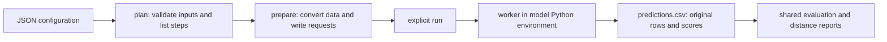

# External baseline model interface

Agentic-TPH originally exposed native PLM/CNN prepare/train/eval/inference interfaces. There was no external-repository model adapter or generic baseline runner. `baseline.py` now owns baseline data preparation, execution requests, environment separation, and prediction normalization. External source repositories are read, never modified.

The existing native inference supports new unlabeled datasets, but native checkpoints and architectures do not load tcrLM state dictionaries. The new interface provides the corresponding route for external models.



## Common commands

Run from `/root/Agentic-TPH-training-code`:

```bash
# Read-only planning; no weights loaded, no external model scripts executed.
python baseline.py plan --config configs/baselines/tcrlm_predict.json
python baseline.py plan --config configs/baselines/tcrlm_train_predict.json

# Prepare inputs/requests only; no model instantiation or training/inference.
python baseline.py prepare --config configs/baselines/tcrlm_train_predict.json

# FUTURE experiment execution, only when requested:
python baseline.py run --config configs/baselines/tcrlm_predict.json
python baseline.py run --config configs/baselines/tcrlm_train_predict.json
```

`run` can prepare a new directory itself or consume a directory previously prepared with the exact same configuration and unchanged input/repo/train/validation. It refuses completed predictions and does not resume a partially trained model. Use a fresh output directory after an interrupted training stage.

Paths in configuration files resolve relative to the CONFIGURATION directory, independently of shell cwd. `repo`, `python`, `input`, `output`, checkpoint paths and explicit train/validation/exclusion paths are configurable. Each model has its own Python executable; the host only needs NumPy/pandas/scikit-learn. Planning lists missing assets without requiring weights. Run checks local assets and external dependencies before calling a worker. Nothing downloads model weights automatically.

## Two supported workflows

| Workflow | Inputs | Steps |
|---|---|---|
| `predict` | New labeled or unlabeled CSV + finetuned checkpoint | Convert input without labels; isolated scoring; restore original rows |
| `train-predict` | Existing train/validation workspace + test CSV + pretrained or finetuned initialization | Prepare training negatives if needed; train on train only; select checkpoint/threshold on validation only; reload selected checkpoint; score test |

Current example configs use the CURRENT on-disk workspace `workspaces/unseen_full_seed42_original/hitph`, which has 2,337/500/500 train/validation/test peptides. Older stratified/tail workspaces are not assumed to exist. No split is redrawn by baseline preparation. Train-predict explicitly checks peptide disjointness across all three inputs. If the intended training task permits shared peptides, this check needs an explicit adapter/protocol change.

Predictions preserve every original field, label if present, and row order, appending `score`, `predicted_label`, `threshold`. Worker input contains model features and stable positional `row_id`; it never contains test labels. The runner verifies one score per row, restores order by row ID, checks finite scores in [0,1], and requires one frozen threshold. Original fields are not normalized in output; model-only copies are trimmed/uppercased. New inputs must not already contain these output column names.

Evaluation is separate from prediction. For the fixed benchmark:

```bash
python report_distance_metrics.py \
  --predictions outputs/baselines/tcrlm_direct/predictions.csv \
  --benchmark workspaces/unseen_full_seed42_original \
  --output outputs/baselines/tcrlm_direct/distance_metrics.json
```

The same command applies to trained predictions. It validates the labeled fixed-test rows before computing overall, per-peptide and distance-layer metrics. A new unlabeled dataset produces scores only; metrics require labels. Existing peptide distances refer to the Agentic-TPH benchmark training split. For a directly loaded external model they are NOT distances to that model's own training corpus. Published model training overlap cannot be established from a state_dict alone; report checkpoint provenance separately.

## tcrLM source review

Inspected repository: `/root/TMP_prediction/baseline_runs/repos/tcrLM`, commit `6c96f6997666214ebc7ac5dae213d127414417e9`.

- `models/encoder.py`: FLASHTransformer with mixed chunk attention, RoPE and relative position bias. Default tcrLM encoders use dimension 512, 48 layers, group size 21, query/key dimension 128 and attention dropout 0.
- `models/tcrLM.py`: `Pretrain` is one encoder with a masked residue prediction head. `Finetune` has independent peptide/TCR encoders, concatenates their token-level outputs, flattens 68 × 512 features, and applies one linear layer producing two logits. The supported checkpoint architecture is `Finetune`; alternative head-only classes are not interchangeable.
- `source/fine_tune.py`: reads five hardcoded CSV folds, freezes both encoders initialized from the pretrained model, trains the classifier using Adam at 1e-3 for 35 epochs, selects by the mean of validation AUROC/accuracy/MCC/F1/AUPR, and saves raw state_dicts. Its FGM parameter-name matches do not correspond to current model names, and encoders are frozen; the new worker does not reproduce this ineffective attack/second backward pass.
- `source/TCR_test.py`: loads a hardcoded finetuned state_dict and evaluates several hardcoded labeled sets. It creates DataLoaders with `drop_last=True`, so it is unsuitable for complete new-set predictions.
- `data/dict.npy`: standard 20-residue vocabulary, IDs 0–19, with `-` padding ID 20. Finetune right-pads both sequences to 34 residues. The adapter rejects unknown residues and overlength evaluation sequences instead of truncating or inventing token IDs.

The worker imports model definitions ONLY, never `fine_tune.py`, `TCR_test.py`, or `pretrain.py`, whose module-level code launches work. It preserves model architecture/state keys and encodes all batches including the tail. It accepts raw state_dict, `state_dict`/`model_state_dict` containers and `module.` prefixes. Pretrained encoder weights can be bare encoder keys or prefixed `protflash.`; `fc_out` pretraining head keys are removed before strict loading into BOTH encoders. Finetuned weights are loaded strictly into the full model. Training saves a full state_dict plus adapter metadata, not optimizer/test outcomes.

### Input scope and projection

Default features are peptide and **beta CDR3 only**, with no MHC or alpha information. For paired canonical input, prefer explicit `cdr3_ab`/`ab_cdr3`, then `ab`. This prevents reconstructed variable-domain `ab` from superseding original CDR3 when the latter is present. Level-IV workspaces require explicit CDR3 identity. `chain=alpha` is possible as a separate input scope, but published beta model weights are not automatically validated for alpha-chain transfer. There is no alpha/beta concatenation mode.

For new direct single-chain CSVs, set:

```json
"settings": {
  "chain": "beta",
  "peptide_column": "peptide",
  "tcr_column": "tcr",
  "batch_size": 64,
  "device": "cuda",
  "mask_width": 20
}
```

Do not silently deduplicate the fixed test after single-chain projection: different paired-TCR/MHC records may have identical peptide/beta features, and sometimes conflicting labels. They legitimately get identical model scores. Plan reports the number of conflicted projection groups. The current validation/test have 15/2 such groups. Metrics remain on the original benchmark records.

Current training contains one beta sequence `CASSQETDIVFNOPQHF` with unsupported `O` at source CSV row 29,278. The training example explicitly sets `unsupported_train=exclude`, retains 106,917 of 106,918 source training rows, and writes excluded rows to `data/excluded_train.csv`. The default policy is `error`; validation/test always error on unsupported inputs. No experimental observations are rewritten. Exclusion identities themselves need not be encodable and are kept in the blacklist.

### Training protocol and upstream differences

The initial implementation intentionally uses one fixed Agentic-TPH train/validation split, not the upstream five folds. Both encoders are frozen, and Adam trains the linear classifier. Defaults in the worker are batch size 64, epochs 35, patience 5 and learning rate 1e-3. Positive-only training receives FIXED 1:1 mismatches once during preparation, seed 42; labeled training with both classes is kept as supplied and projected-label conflicts are rejected. Donors come only from retained training TCRs. The workspace blacklist and all train/validation records are projected to the selected chain; endpoint-normalized known identities are blocked across MHC alleles. This differs from native dynamic paired-TCR sampling and is recorded in the plan.

Checkpoint selection is validation AUROC, and the threshold is selected by maximum validation MCC with the common `score >= threshold` convention. The upstream average-of-five-metrics selection and fixed `score > 0.5` convention are not reproduced. Test data never enters worker optimization or threshold selection. Direct raw finetuned checkpoints without adapter metadata default to upstream threshold 0.5; optional explicit `threshold` overrides it. Adapter-produced checkpoints save their validation threshold and reject chain/mask metadata mismatch.

**Mask compatibility:** upstream `FLASHTransformer.forward` calls `length_to_mask` with default width 20, despite 34-slot finetune inputs. Group broadcasting makes this executable but changes mask semantics. Default `mask_width=20` preserves upstream behavior for raw published checkpoints. Explicit `mask_width=34` applies a process-local wrapper to the upstream mask function, without editing its repository; this is a corrected variant and must be declared separately. Never claim numerical equivalence between these modes. Training checkpoints record mask width. Real-checkpoint equivalence and performance have not been tested in this interface-only implementation.

## Prepared review artifacts and current readiness

This implementation run prepared both workflows, without invoking a real model:

- `baseline_plans/tcrlm_predict/`: static direct-prediction inputs, request, resolved config and plan.
- `baseline_plans/tcrlm_train_predict/`: static train/validation/test inputs, fixed training negatives, requests and plan.

No real scores, trained model or experiment logs were produced. Checkpoint paths in examples are placeholders matching upstream script conventions; neither `pretrained_model_tcr.bin` nor `finetuned_model.bin` is present in the inspected repository. The current Python also lacks `einops`. Supply the local checkpoints and choose/configure the model environment before future `run`. The interface tests use fixtures and a mocked worker, not GPU/model experiments.

## Adding another model

1. Add an Adapter subclass in `baselines/adapters.py`, with `name`, `dependencies`, `worker`, `validate(repo,settings)` and `convert(frame,settings)`. Conversion must retain ordered `row_id` and normalized `peptide`; this implementation's common single-chain training helper also needs `tcr`.
2. Override `training_input`, `convert_exclusions` or `prepare_training` if the model has different sequence support, multi-chain features, negative sampling or label semantics. Include any extra model feature columns in the converted table.
3. Add an isolated worker implementing the `--request` JSON contract for train/predict. Predict returns `row_id,score,threshold`; train saves the checkpoint at the agreed `model/best.pt` path with frozen threshold metadata. Other architecture/checkpoint specifics belong in the worker.
4. Register the class in `ADAPTERS` and add JSON examples. Runner execution, row restoration, output format and fixed-test metrics remain shared.

This separation supports incremental adapters without importing different model packages into the Agentic-TPH process. New workflows or fundamentally different outputs need a deliberate common contract extension.

## Unified evaluation entry point

For any new LABELED prediction CSV, evaluate without a workspace:

```bash
python baseline.py evaluate \
  --predictions /path/to/new_predictions.csv \
  --peptide-column pep \
  --output /path/to/new_metrics.json
```

For raw tcrLM-style inputs use `--peptide-column peptide`. Without `--benchmark`, only overall row-pooled/per-peptide metrics are reported; distances are not invented. For the current canonical fixed benchmark, add `--benchmark workspaces/unseen_full_seed42_original` to verify exact test correspondence and compute the existing distance report. Labels are required for evaluation but never for inference.
